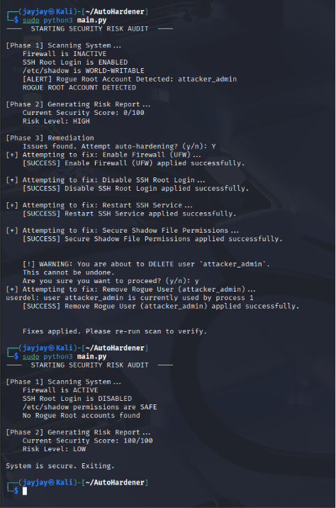

# Auto-Hardener
### Automated Linux Security Auditing & Hardening Tool

Auto-Hardener is a Python-based security auditing and hardening tool for Linux systems. 
It scans for common security misconfigurations, scores the system's security posture, 
applies fixes automatically where needed, and logs every action for review.

Built as a learning project to understand Linux security, Python scripting, and 
CIS benchmark controls — but designed to be genuinely useful in real environments.

---

## Architecture

The tool is split into four files, each with a single responsibility:

| File | Responsibility |
|------|---------------|
| `checks.py` | Scans the system for security misconfigurations |
| `hardener.py` | Applies fixes for detected vulnerabilities |
| `main.py` | Orchestrates the scan, scoring, and remediation flow |
| `logger.py` | Records all audit actions to a persistent log file |

---

## Security Controls Audited

| Control | CIS Reference | Risk Weight |
|---------|--------------|-------------|
| UFW Firewall Status | - | -20 |
| SSH Root Login | - | -30 |
| /etc/shadow Permissions | CIS 6.1.10 | -40 |
| Rogue Root Accounts (UID 0) | CIS 6.2.5 | -50 |

---

## Risk Scoring

The tool calculates a security score from 0-100 based on detected findings:

| Score | Risk Level |
|-------|-----------|
| 100 | LOW — system is secure |
| 60-99 | MEDIUM — misconfigurations present |
| 0-59 | HIGH — severe misconfigurations |
| Any score with rogue root | HIGH — confirmed backdoor, always critical |

---

## Key Features

**Automated Compliance Auditing**
Real-time scanning of critical security controls against CIS benchmark standards.

**Adaptive Risk Scoring**
Weighted scoring system that reflects the actual severity of each finding. 
Rogue root accounts always force a HIGH risk rating regardless of overall score.

**Interactive Auto-Remediation**
Automatically applies fixes for detected vulnerabilities. Destructive actions 
like user deletion include a human confirmation step to prevent accidents.

**Simulation Mode**
Dry-run capability to preview what changes would be made without touching the system.

**Persistent Audit Logging**
Every scan, finding, and remediation action is logged to `autohardener.log` with 
timestamps and severity levels. Log file rotates automatically at 1MB, keeping 
3 backups for audit trail continuity.

---

## Sample Output

### All issues detected and remediated:


---

## Installation

```bash
git clone https://github.com/1jAy-JaY1/Auto-Hardener.git
cd Auto-Hardener
```

No external dependencies — standard library only (`os`, `sys`, `subprocess`, `logging`, `pathlib`).

---

## Usage

Must be run as root:

```bash
sudo python3 main.py
```

To review the audit log after a run:

```bash
cat autohardener.log
```

---

## Log Format

Each entry follows this format:

```
2026-05-13 10:31:56 - INFO     - Firewall: ACTIVE
2026-05-13 10:31:56 - WARNING  - SSH Root Login: ENABLED
2026-05-13 10:31:56 - CRITICAL - Rogue Root Account Detected: attacker_admin
2026-05-13 10:31:56 - INFO     - FIX APPLIED: Enable Firewall (UFW)
2026-05-13 10:31:56 - ERROR    - FIX FAILED: Restart SSH Service
```
---

## Platform

- **Language:** Python 3
- **Dependencies:** Standard library only
- **Platform:** Linux (tested on Kali Linux, Ubuntu, Debian)
- **Privileges:** Requires root

---

## Author

Built by [1jAy-JaY1](https://github.com/1jAy-JaY1) as a practical learning 
project in Python and Linux security hardening.
